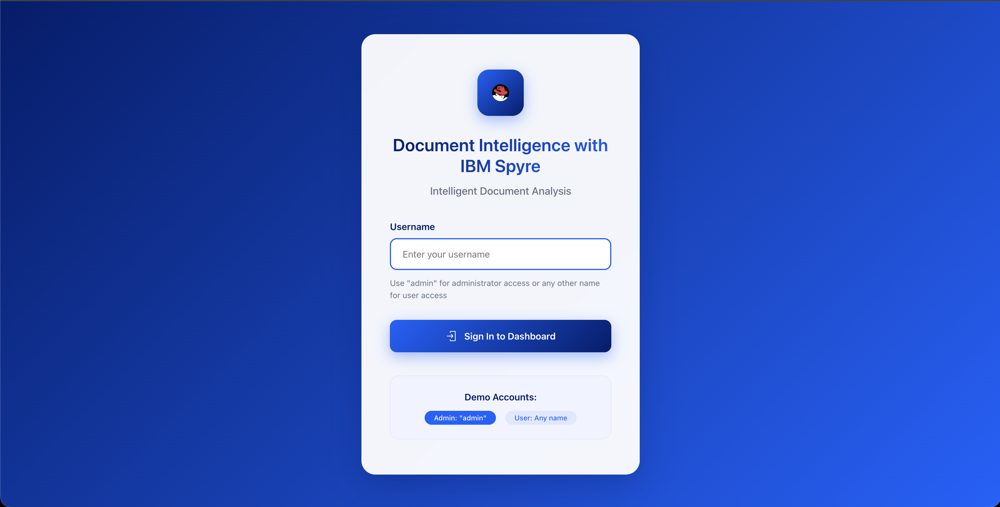

# AI on Spyre Accelerator for IBM Z & IBM LinuxONE Document Summarizer Solution Template

This repository contains code for summarizing documents using Spyre with Red Hat AI Inference Server.
This is an [AI on IBM Z solution template](https://ambitus.github.io/aionz-solution-templates/) for document summarization using Spyre. This solution template provides an example on how to deploy RHAIIS in an IBM Z environment, while making use of Spyre, Granite models, and more.

# 

## Prerequisites

- Podman
- podman-compose
- RHAIIS


## Installation as a container

### 1. Build and run the container

```bash
podman-compose up --build -d
```

### 2. Open the Frontend UI in Your Browser

Visit the following URL to access the application:
```bash
http://localhost:3002
```

### 3. [Optional] Adjust Podman VM resources (CPU, Memory, Disk)

```bash
# Stop the Podman machine
podman machine stop podman-machine-default

# Update resources (example: 4 CPUs, 8 GB RAM, 100 GB disk)
podman machine set --cpus 4 --memory 8192 --disk-size 100 podman-machine-default

# Restart the machine with the new configuration
podman machine start podman-machine-default
```


## Authors & Contributors
- Development:
    - Tabari Alexander (thalexan@us.ibm.com)
    - Abid Alam (abidalam@ibm.com)
    - Rishika Kedia (rishika.kedia@in.ibm.com)
    - Saurabh Srivastava (saurabh.srivastava4@ibm.com)
    - Vishwas R (Vishwas.R@ibm.com)
    - Ganeshi Shreya (Shreya.Ganeshi@ibm.com)
    - Prasanna Gn (Prasanna.Gn@ibm.com)
    - Dilip B (Dilip.Bhagavan@ibm.com)

